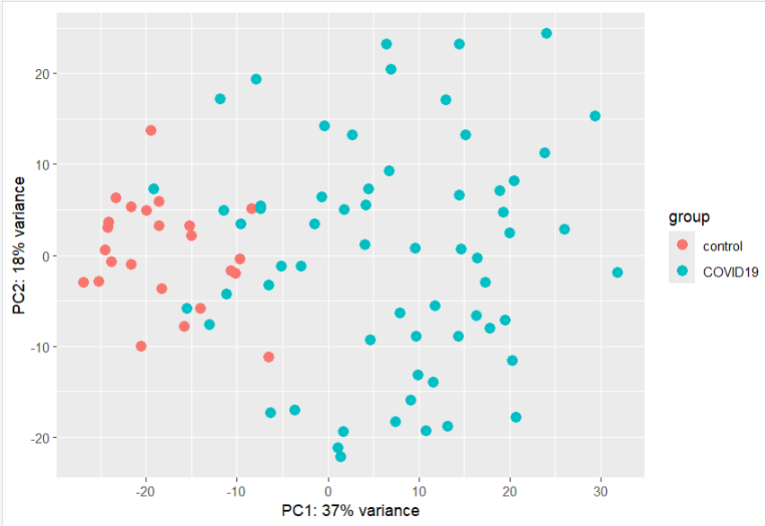
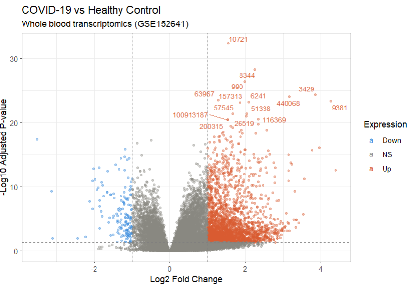
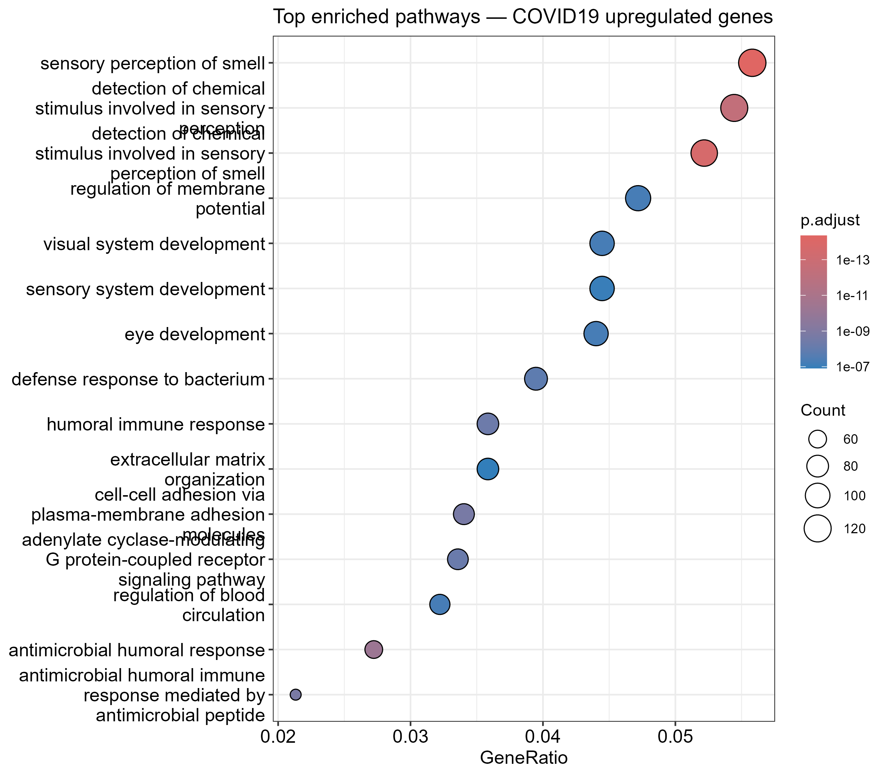

# RNA-seq Analysis: COVID-19 vs Healthy Whole Blood

Differential gene expression analysis of whole blood transcriptomics from COVID-19 patients and healthy controls, using publicly available data from [GSE152641](https://www.ncbi.nlm.nih.gov/geo/query/acc.cgi?acc=GSE152641).

---

## Background

COVID-19 (caused by SARS-CoV-2) triggers a broad and complex transcriptional response in blood cells, involving immune activation, antiviral defence, and neurological disruption. This project performs an end-to-end RNA-seq analysis to identify differentially expressed genes (DEGs) and enriched biological pathways in COVID-19 patients compared to healthy controls.

The dataset comprises whole blood samples from **62 COVID-19 patients** and **24 healthy controls**, profiling **19,936 genes** after quality filtering.

---

## Key Findings

- **9,168 significant DEGs** identified (padj < 0.05, |log2FC| > 1)
  - 6,294 upregulated in COVID-19
  - 2,900 downregulated in COVID-19
- **Top upregulated gene: IFI27** — a classical interferon-stimulated gene, consistent with the known COVID-19 interferon response
- **APOBEC3A/APOBEC3A_B** strongly upregulated — antiviral RNA-editing enzymes directly targeting the virus
- **Cell cycle disruption**: RRM2, CDC6, CLSPN, MCM10, POLQ — COVID-19 hijacks DNA replication machinery, with implications for cancer biology (several are oncogenes)
- **Pathway enrichment reveals anosmia signature**: the most significantly enriched GO terms were sensory perception of smell pathways — directly reflecting COVID-19's well-known neurological symptom of smell loss at a transcriptomic level

---

## Methods

| Step | Tool | Purpose |
|------|------|---------|
| Data retrieval | `GEOquery` | Download count matrix and metadata from NCBI GEO |
| DE analysis | `DESeq2` | Normalisation, dispersion estimation, negative binomial testing |
| Visualisation | `ggplot2`, `ggrepel`, `pheatmap` | Volcano plot, PCA, heatmap |
| Gene annotation | `org.Hs.eg.db`, `AnnotationDbi` | Entrez ID to gene symbol conversion |
| Pathway enrichment | `clusterProfiler` | GO biological process over-representation analysis |

---

## Figures

### PCA — Sample separation by condition


Controls cluster tightly (left). COVID-19 samples spread broadly along PC1 (37% variance), reflecting heterogeneity in disease severity.

### Volcano Plot — Differentially expressed genes


Red = upregulated in COVID-19. Blue = downregulated. Top labelled genes include IFI27, APOBEC3A, RRM2, and CDC6.

### Pathway Enrichment — Top GO biological processes


Olfactory/sensory perception pathways are the most significantly enriched, capturing the transcriptional basis of COVID-19-associated anosmia. Antimicrobial and humoral immune response terms confirm expected immune activation.

---

## Relevance to Research Fields

**Infectious Disease**: Characterises the whole-blood transcriptional response to SARS-CoV-2, identifying key antiviral (APOBEC3A) and interferon (IFI27) mediators.

**Neuroscience**: Enrichment of olfactory sensory perception pathways in peripheral blood provides a systemic transcriptomic signature of COVID-19-associated anosmia — a clinically important neurological symptom.

**Cancer Biology**: Multiple top DEGs (RRM2, CDC6, POLQ, CLSPN, MCM10) are established oncogenes involved in DNA replication and repair. COVID-19 appears to dysregulate the same pathways exploited by cancer cells.

---

## Reproducing This Analysis

### Requirements

- R ≥ 4.3.0
- RStudio

### Install dependencies

```r
if (!require("BiocManager", quietly = TRUE))
    install.packages("BiocManager")

BiocManager::install(c("DESeq2", "clusterProfiler", "org.Hs.eg.db", "GEOquery"))
install.packages(c("ggplot2", "ggrepel", "pheatmap", "R.utils"))
```

### Download data

```r
library(GEOquery)
gse <- getGEO("GSE152641", GSEMatrix = TRUE)
getGEOSuppFiles("GSE152641")
```

### Run analysis

Open `scripts/analysis.R` in RStudio and run section by section, or source the entire script:

```r
source("scripts/analysis.R")
```

---

## Project Structure

```
rnaseq-covid19/
├── data/
│   ├── GSE152641_counts.csv       # raw count matrix
│   └── metadata.csv               # sample condition labels
├── scripts/
│   └── analysis.R                 # full analysis pipeline
├── results/
│   ├── figures/
│   │   ├── pca_plot.png
│   │   ├── volcano_plot.png
│   │   └── pathway_enrichment.png
│   └── tables/
│       ├── DESeq2_results.csv
│       └── GO_enrichment.csv
├── .gitignore
├── LICENSE
└── README.md
```

---

## Dataset

**GEO Accession**: [GSE152641](https://www.ncbi.nlm.nih.gov/geo/query/acc.cgi?acc=GSE152641)  
**Publication**: Thair et al. (2020) *Transcriptomic similarities and differences in host response between SARS-CoV-2 and other viral infections.* iScience.

---

## Author

**Akash Dash** | [@AkashDash-bio](https://github.com/AkashDash-bio)  
Independent bioinformatics project — RNA-seq differential expression analysis
